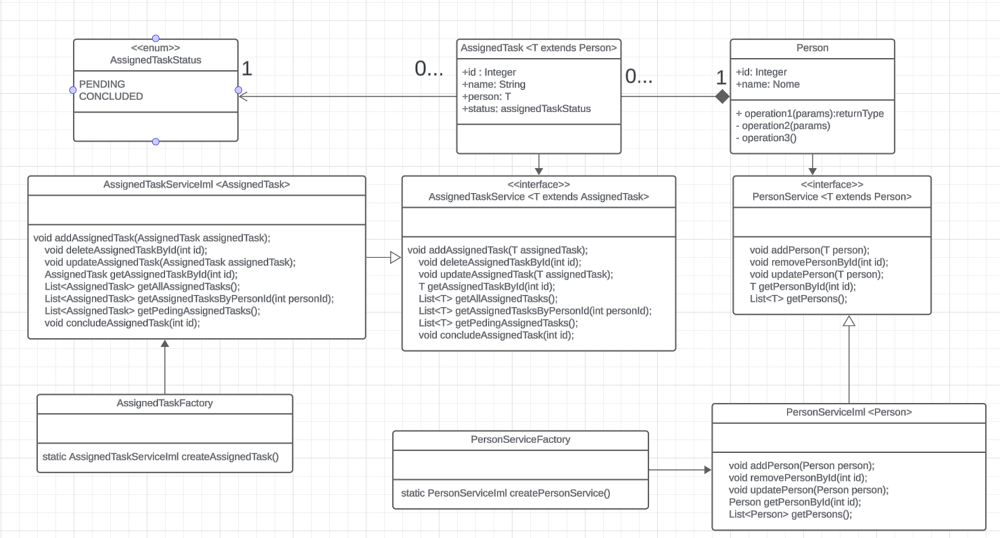
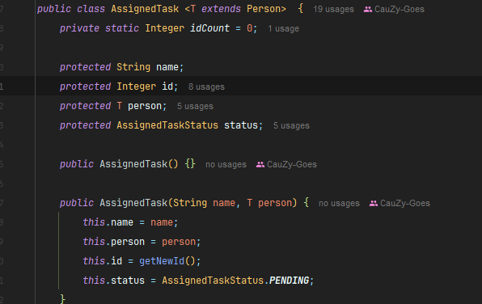
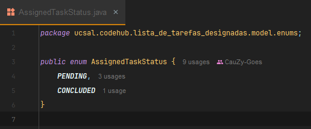
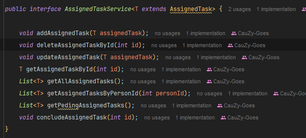
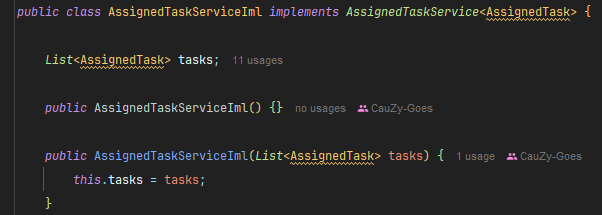
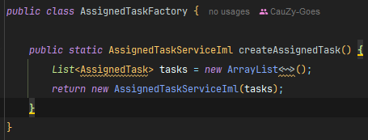
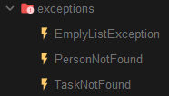

# Lista-De-Tarefas-Designadas

This project is a simple Java application for managing tasks and people. Each task is assigned to a person and can have a status of pending or completed. The project uses entities to represent tasks and people, and services to manage these entities.

## Features

- **Create:** Add new persons and tasks at localStorage.
- **Read:** Retrieve information about persons and tasks from the local Storage.
- **Update:** Modify existing persons and tasks details.
- **Delete:** Remove persons and tasksfrom the local storage.

## Getting Started

### Pre-requisites

- Java Development Kit (JDK)

### Installation

1. Clone the repository to your local machine:

## Screenshots

### Class Diagram

### AssignedTask Entity

### Status Enum

### TaskService Terminal

### AssignedTaskServiceiml Service

### Factory

### exceptions

## Technologies Used

- Java

## Contributors

- [CauZy-Dev](https://github.com/cauzy-dev) Cauã Goes
- [Yan-Pi](https://github.com/yan-pi) Yan Fernandes
- [Zadriw](https://github.com/ZadriW) Adriano Abreu
- [CauZy-Dev](https://github.com/cauzy-dev) Guilherme Andrade
- [CauZy-Dev](https://github.com/cauzy-dev) Kailan Souza

## License

This project is licensed under the [Licença MIT](https://github.com/Codee-Hub/Lista-De-Tarefas-Designadas/blob/main/LICENSE).

